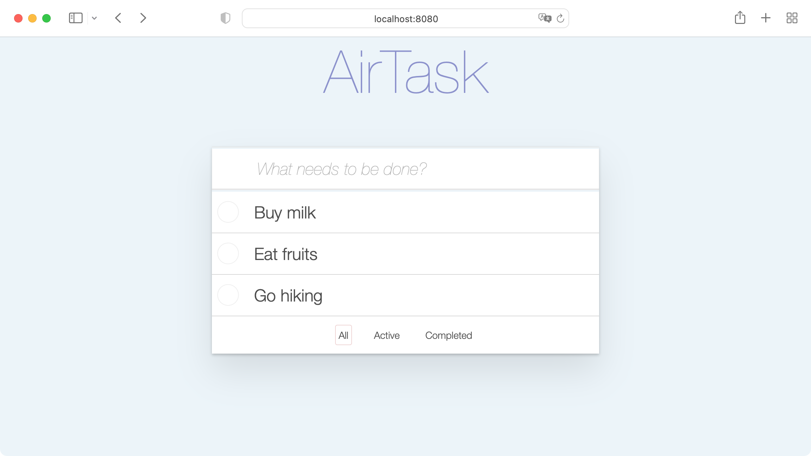

# Simple Todo App



- Database: [SQLite](https://sqlite.org)
- GraphQL Backend: [Airsequel]
- GraphQL Client: [Apollo Client](https://www.apollographql.com/apollo-client/)
- Frontend: [React](https://reactjs.org)
- Styling: [Styled Components](https://styled-components.com)


## Getting Started

1. Install dependencies: `npm install`
1. Create new database from scratch at [Airsequel]
1. Rename created table from `table-1` to `todos`
1. Add / rename columns to achieve following schema:
    ```sql
    rowid INTEGER PRIMARY KEY,
    title TEXT NOT NULL,
    completed BOOLEAN
    ```
1. Update database URL in `index.js` and `main.jsx`
1. Start app:
    ```sh
    npm start
    ```
1. Open <http://localhost:8080/>


[Airsequel]: https://www.airsequel.com
